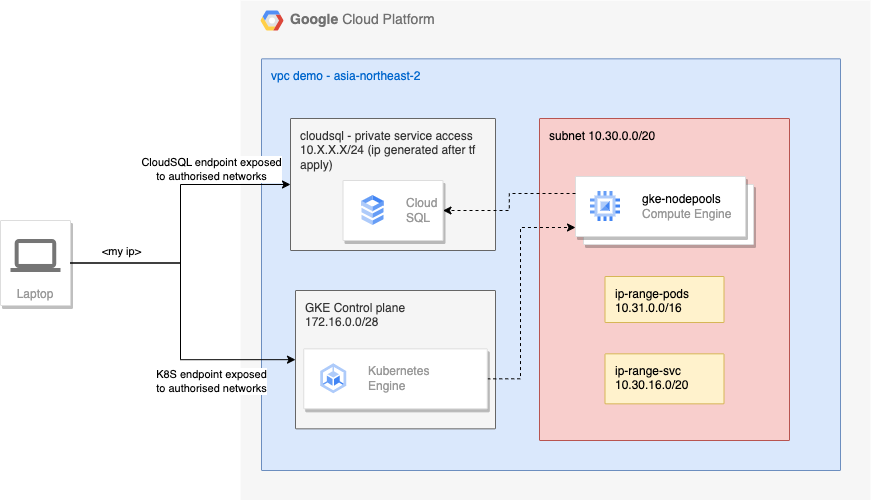

# Demo terragrunt

This repository show an example file/folder structure you can use with [Terragrunt](https://github.com/gruntwork-io/terragrunt) to keep your [Terraform](https://www.terraform.io) code DRY.

It is part of a set of repositories that allow to deploy a demo-app on gcp, here is the link to the [general documentation](https://github.com/eistin/demo-docs).

## What is deployed ? 

- A VPC with a single a subnet including secondary ranges for pods and svcs IPs. It also creates the NAT gateway and a private access to cloudsql databases.
- A private GKE cluster exposing a public k8s endpoint whitelisted to authorised networks. 
- A private ClousSQL (mysql) database exposed only to authorised networks. 

### Schema



## How do you deploy the infrastructure in this repo?

### Pre-requisites

1. Install [Terraform](https://www.terraform.io/) version `0.13.0` or newer and
   [Terragrunt](https://github.com/gruntwork-io/terragrunt) version `v0.25.1` or newer.
2. Fill in your GCP Project ID in `my-project/project.hcl`.
3. Make sure gcloud CLI is installed and you are authenticated,otherwise run `gcloud auth login` + `gcloud auth application-default login`.
4. Create a secret for your database in the secret manager named `demo-user-clousql-password`.
5. Create a file to whitelist your own IP `cp environments/_envcommon/myip.hcl.example environments/_envcommon/myip.hcl` and add your IP address. 

### Deploying a single module

1. `cd` into the module's folder (e.g. `cd environments/dev/<project_name>/<region>/vpc`).
2. Run `terragrunt plan` to see the changes you're about to apply.
3. If the plan looks good, run `terragrunt apply`.


### Deploying all modules in an environment

1. `cd` into the environment folder (e.g. `cd environments/dev/<project_name>/<region>/vpc`).
1. Run `terragrunt run-all plan` to see all the changes you're about to apply.
1. If the plan looks good, run `terragrunt run-all apply`.

### Destroying all modules in an environment

1. `cd` into the environment folder (e.g. `cd environments/dev/<project_name>/<region>/vpc`).
2. Run `terragrunt run-all plan -destroy` to see all the destroy changes you're about to apply.
3. If the plan looks good, run `terragrunt run-all destroy`.

## How is the code in this repo organized?

The code in this repo uses the following folder hierarchy:

```
environments
 └ _envcommon
 └ <env>
    └ _global
    └ <project>
        └ <region>   
            └ resources
```

## About security

### Endpoints
The infrastructure has only 2 public endpoints : 
- K8S API
- CloudSQL Database
  
These endpoints are only exposed to authorised networks. This could be improved by deploying a public bastion using IAP (for google authentication).

### Secrets
Here we use 2 ways to protect our secrets :
- Use the module [Data secret manager](https://github.com/eistin/tf-module-gcp-data-secret-manager) in order to get the secrets.
- Using a non-pushed file as in the case of myip.

We could also consider using the [env variables method](https://developer.hashicorp.com/terraform/language/values/variables#environment-variables).